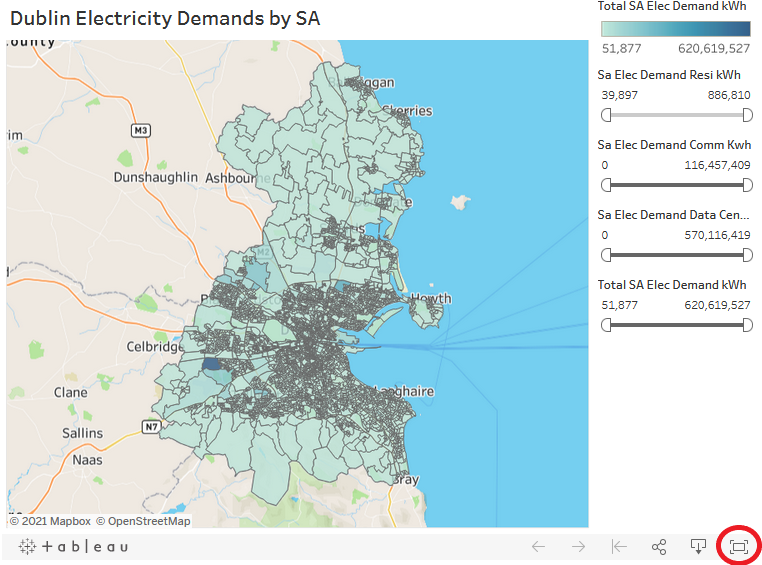

This website contains actively maintained, up-to-date Dublin Energy webmaps including:

- Buildings
    - [Residential BER Map Postcode](buildings/BER-Postcode-Map.md)
    - [Residential BER Map Small Area](buildings/BER-SA-Map.md)
    - [Residential Retrofit Scenario Map](buildings/Residential-Retrofit.md)
    - [Heat Pump Viability Map](buildings/Heat-Pump-Viability.md)
- Demand
    - [Electricity](demands/Electricity.md)
    - [Gas](demands/Gas.md)
    - [Heat](demands/Heat.md)
- Socio Economic
    - [Deprivation Index by Small Area](socio-economic/deprivation-index.md)
- Carbon Emissions
    - [Carbon Emissions](emissions/Carbon-Emissions.md)

---

> Click Fullscreen on for a better image!

> 

---

This website was created by the [codema-dev](https://github.com/codema-dev/) team as part of the SEAI RD&D funded [Dublin Region Energy Masterplan project](https://www.codema.ie/projects/local-projects/dublin-region-energy-master-plan/).

&emsp;
&emsp;
 